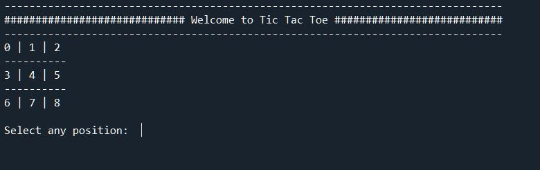
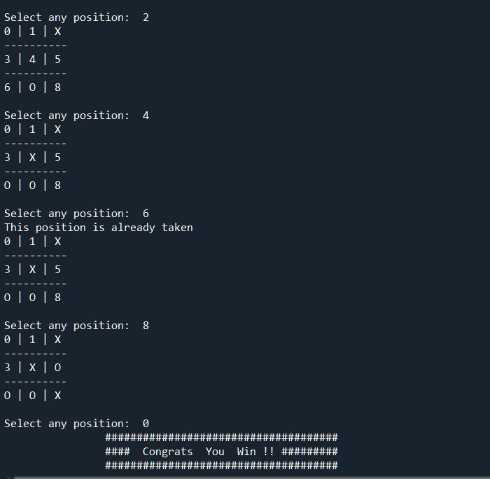

# *Tic-tac-toe*

Tic-tac-toe (also known as noughts and crosses or Xs and Os) is a paper-and-pencil game for two players, X and O, who take turns marking the spaces in a 3×3 grid. The player who succeeds in placing three of their marks in a horizontal, vertical, or diagonal  wins the game.

# *Requirements*

```
import numpy as np
import random
```




